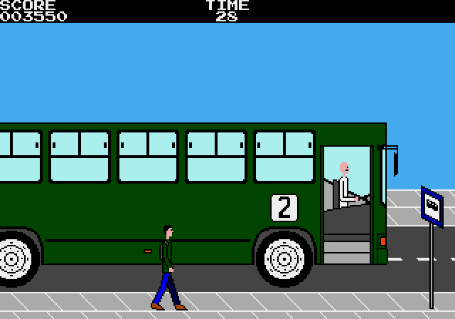
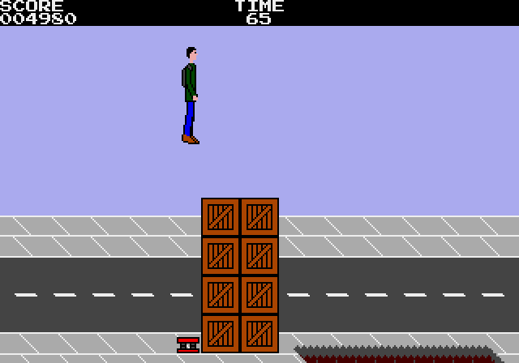
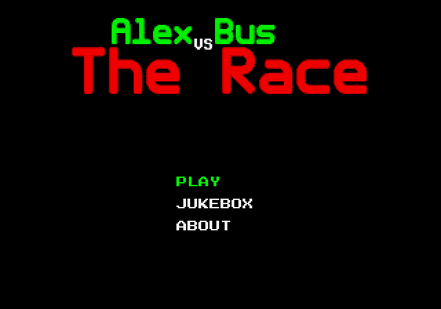

# Alex vs Bus: The Race (Sega Genesis port)

This is a Sega Genesis/Mega Drive port of "Alex vs Bus: The Race", a free and
open source platform runner game in which Alex is just a man who depends on
public transportation in a developing country and needs to run in order to catch
the bus, or else he will have to wait an eternity for the next bus to come.

The original game can be found at https://github.com/M374LX/alexvsbus.

This pre-release of the port is already playable from start to finish in both
NTSC and PAL and features SRAM saving.

## Building the ROM

The assembler we use for the official build is vasm with the Motorola syntax. It
can be found at http://sun.hasenbraten.de/vasm.

With the assembler installed on the system, you can run the ``build.sh`` shell
script to build the ROM.

After the ROM is built, you can optionally use the ``fix-rom`` tool, found in
the ``tools`` directory, to check the ROM and fix the checksum. While the game
does not test the checksum, fixing the checksum prevents some emulators from
displaying a warning. We use the tool for the official build.

If the assets are modified, they will need to be converted into data for the ROM
before it is built. With the tools in the ``tools`` directory built, the
``data-conv.sh`` script runs the appropriate tools for the conversion.

## TODO

- Tweak screen transition effects
- Add settings to disable music and sound effects
- Add a way to erase SRAM
- Document data formats, including levels and music streams
- Document tools in the ``tools`` directory
- Add more comments to the code
- Add the missing square wave channel to the title BGM track

